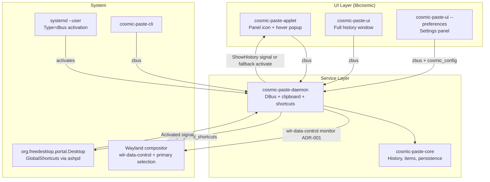
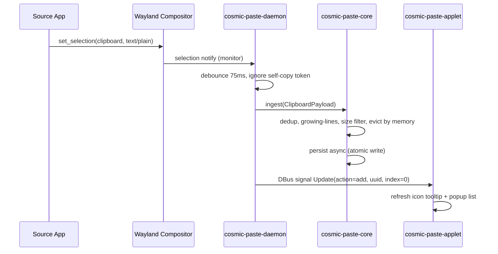
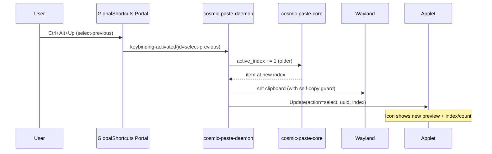
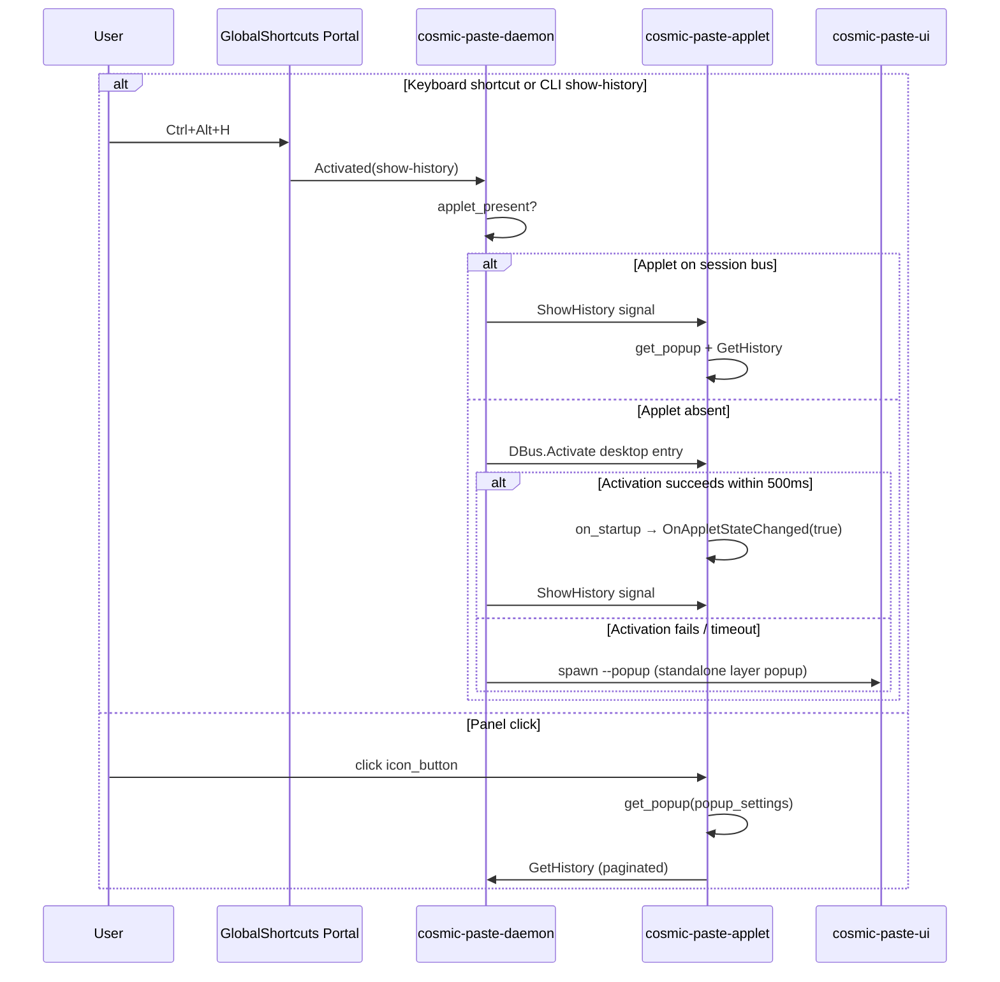

# cosmic-paste: Clipboard Manager for COSMIC Desktop

> **Third-party software.** Not official COSMIC or System76 software. Targets the COSMIC desktop; uses `com.system76.*` app IDs following COSMIC conventions.

| Field | Value |
|-------|-------|
| **Author** | Erik Balfe |
| **Date** | 2026-06-13 |
| **Status** | Draft |
| **Project** | `cosmic-paste` |
| **App ID** | `com.system76.CosmicPaste` |
| **Repository** | `https://github.com/erik-balfe/cosmic-paste` |

---

## Overview

**cosmic-paste** is a GPaste-inspired clipboard manager for System76's COSMIC desktop on Wayland. It follows GPaste's proven **daemon-centric, modular architecture**: a long-lived background service owns clipboard monitoring and history; thin UI processes (panel applet, full history window) and a CLI client communicate exclusively over DBus.

Unlike GPaste's GNOME Shell extension, COSMIC integration uses **libcosmic panel applets** (`cosmic::applet::run`) with hover popups, **cosmic_config** for settings, and the **freedesktop XDG GlobalShortcuts portal** (`org.freedesktop.portal.Desktop`, via `ashpd` in the daemon) for Wayland-safe global keybindings. The design extends GPaste with **panel icon status display** (preview, active index, count) and **dedicated prev/next history navigation shortcuts**—features GPaste does not provide globally.

Target users are COSMIC desktop users who copy frequently (developers, writers, sysadmins) and want GPaste-equivalent power with native COSMIC look-and-feel.

---

## Background & Motivation

### Current State on COSMIC

COSMIC ships no first-party clipboard manager. Users rely on:

- **wl-clipboard** (`wl-copy` / `wl-paste`) — stateless, no history
- **GPaste** — GNOME-centric; no COSMIC panel applet; GTK4 UI works but panel integration is absent
- Ad-hoc scripts — fragile, no persistence

### Pain Points

| Pain Point | Impact |
|------------|--------|
| No persistent clipboard history | Lost work on accidental overwrite |
| No panel indicator | No at-a-glance status of current selection |
| No global history navigation | Must open menu and arrow-key through items |
| Primary vs clipboard confusion | Wayland has separate selections; users need sync controls |
| Password/sensitive data in history | Security risk without obfuscation and named passwords |
| Large copy payloads (images, files) | Memory blow-up without limits and dedup |

### Reference Implementations in User's Workspace

| Project | Relevant Pattern |
|---------|------------------|
| `cosmic-launcher` | libcosmic app, `zbus`, `cosmic_config`, `tracing-journald`, popup surfaces — **not** daemon `Type=dbus` activation |
| `cosmic-applet-template` | `cosmic::applet::run`, `icon_button`, `get_popup` / `destroy_popup`, `popup_container` |
| `cosmic-term` | `clipboard::read/write/read_primary/write_primary` for in-app clipboard I/O; `secret-service` passwords |
| `cosmic-utils/clipboard-manager` | **wlr-data-control** clipboard watch, libcosmic applet, SQLite persistence — closest COSMIC prior art |
| `voice-input` | systemd user daemon lifecycle, portal settings watch; shortcuts via **COSMIC Settings** (different from GlobalShortcuts portal) |
| GPaste (`org.gnome.GPaste2`) | DBus API surface, `Type=dbus` systemd activation, history model, `GPasteGtkGlobalShortcutClient`, settings keys |

---

## Goals & Non-Goals

### Goals

1. **Feature parity with GPaste 50.x** for capture, history, passwords, images, multiple histories, CLI, persistence, and edge cases — **excluding upload/pastebin**.
2. **Native COSMIC UX**: panel applet with hover popup, libcosmic-themed full history window, cosmic_config settings.
3. **Panel status via tooltip** showing truncated preview of active item, 1-based index, and total count (e.g. `3/47: git commit mes…`) — **tooltip only in v1**.
4. **Global keyboard shortcuts** for GPaste defaults (**except upload**) plus **prev/next active item**; **optional** global quick-select 0–9 (**disabled by default**); in-popup Ctrl+index overlay (US-030) always available.
5. **DBus-first API** (`org.system76.CosmicPaste`) mirroring GPaste's `org.gnome.GPaste2` for scripting compatibility mindset.
6. **Wayland-only** clipboard monitoring (no X11 backend).
7. **Incremental, reviewable PR plan** (see bottom).

### Non-Goals (v1)

- GNOME Shell extension
- X11 support
- COSMIC Launcher search provider integration (future)
- cosmic-settings deep integration panel (standalone preferences app in v1; cosmic-settings plugin in v2)
- Cloud sync of histories across machines
- Windows/macOS ports
- Tauri or Electron UI shell
- **Pastebin / upload** (`Ctrl+Alt+U`, `Upload` DBus method, `cosmic-paste upload`) — out of scope for cosmic-paste

---

## Architecture Recommendation: libcosmic Native (Not Tauri)

### Decision: Pure Rust / libcosmic Multi-Binary Workspace

```
cosmic-paste/                    # Cargo workspace
├── cosmic-paste-core/           # History, items, settings, persistence (no UI)
├── cosmic-paste-daemon/         # Clipboard monitor + DBus server + shortcuts
├── cosmic-paste-applet/         # Panel indicator + hover popup
├── cosmic-paste-ui/             # Full history window
├── cosmic-paste-cli/            # CLI (cosmic-paste-client binary)
└── data/                        # systemd, desktop, dbus, cosmic config schemas
```

### Tauri Evaluation

| Criterion | Tauri | libcosmic Native |
|-----------|-------|------------------|
| COSMIC panel applet | ❌ No `cosmic::applet` integration | ✅ First-class (`cosmic-applet-template`) |
| Theme consistency | ❌ Webview styling mismatch | ✅ `cosmic::applet::style()`, cosmic theme tokens |
| Wayland clipboard daemon | ⚠️ Rust core possible, but split stack | ✅ Unified Rust workspace |
| Memory footprint | ❌ Webview + Node toolchain | ✅ ~5–15 MB per UI process |
| Global shortcuts | ⚠️ Needs separate Rust sidecar anyway | ✅ Daemon owns portal bindings |
| DBus activation | ⚠️ Awkward with webview lifecycle | ✅ GPaste `Type=dbus` systemd pattern for daemon |
| Maintenance | ❌ Two UI stacks (Rust + frontend) | ✅ Single ecosystem (pop-os/libcosmic) |
| Packaging on Fedora/COSMIC | ⚠️ Extra webview deps | ✅ Same deps as other COSMIC apps |

**Verdict:** Tauri is unsuitable for the **panel applet** (primary UI). A Tauri full-history window would add complexity without benefit over libcosmic, which already provides `multi-window`, search widgets, and cosmic-settings-style panels. **Reject Tauri** for all cosmic-paste UI surfaces (applet + full window + preferences) to keep one theme stack.

*Footnote:* `voice-input` in this workspace uses Tauri for a settings/history window while keeping a Rust daemon — acceptable for that project, but not recommended here where libcosmic covers all surfaces and `cosmic-launcher` is cited only for **cosmic_config / logging**, not daemon lifecycle.

### Component Architecture



### Key Flows

#### Copy Capture Flow



#### Shortcut: Select Previous Item



#### Popup Open (Panel Click or Ctrl+Alt+H)



#### ShowHistory When Applet Not in Panel

COSMIC panel applets run **only if the user added them**. Unlike GPaste's always-loaded GNOME Shell extension, `ShowHistory` must not silently fail.

**Fallback chain (daemon `show_history()`):**

1. Query `AppletPresent` property (maintained via `OnAppletStateChanged` from applet lifecycle).
2. If present → emit `ShowHistory` signal to applet match rule subscribers.
3. If absent → DBus `ActivateAction` on **`com.system76.CosmicPaste.Applet`** (see §3 Applet DBus activation) with action `show-history` (starts applet process).
4. Wait up to **500 ms** for `OnAppletStateChanged(true)`; then emit `ShowHistory`. **Acceptance:** process starts **and** popup opens if applet has a panel slot; if process starts without panel slot, proceed to step 5.
5. If still no popup → spawn `cosmic-paste-ui --popup` (requires **PR 7b** minimal popup surface — must merge before PR 7 wires this step).

**US-033** (new) covers this path explicitly.

---

## Proposed Design

### 1. Daemon (`cosmic-paste-daemon`)

**Responsibilities:**

- DBus-activated **systemd `Type=dbus` user service** (GPaste `data/dbus/org.gnome.GPaste.dbus.in` + `data/systemd/` pattern — **not** `cosmic-launcher`'s UI `dbus_activation` handler)
- Owns `ClipboardMonitor` for `clipboard` and optionally `primary` selections
- Owns `HistoryManager` (in-memory + async persistence) including **active index state**
- Registers global shortcuts via **`ashpd`** → `org.freedesktop.portal.Desktop` / `org.freedesktop.portal.GlobalShortcuts`
- Emits DBus signals on history mutations
- Screensaver clipboard restore deferred to **v1.1** (see Security § threat downgrade)

**Clipboard monitoring — ADR-001 (spike required before PR 4 merge):**

The initial draft incorrectly claimed `smithay-clipboard` is used in COSMIC projects. Verification shows **no `smithay-clipboard` usage** in `cosmic-launcher` or `cosmic-term`. The closest COSMIC implementation is **`cosmic-utils/clipboard-manager`**, which monitors via **`zwlr_data_control_manager_v1` (wlr-data-control)** through libcosmic/cctk. `cosmic-comp` exposes both `wlr_data_control` and `ext_data_control` globals.

| Option | Pros | Cons | COSMIC evidence |
|--------|------|------|-----------------|
| **A: wlr-data-control** (recommended pending spike) | Matches `clipboard-manager`; compositor supports it; full MIME read/write for monitor + select | Requires Wayland event loop integration in tokio daemon | `cosmic-comp` `wlr_data_control_state`; `clipboard-manager` production use |
| **B: smithay-clipboard** | Higher-level API; handles offer/read | Not validated on COSMIC; extra abstraction over data-control | None in workspace |
| **C: arboard** | Simple text-focused API | Limited MIME (text/image); weak primary-selection story on Wayland | None in workspace |

**Spike deliverable (PR 4 gate):** `docs/adr/001-clipboard-monitor.md` with prototype on COSMIC compositor documenting:

- MIME coverage: `text/plain`, `text/html`, `text/uri-list`, `image/png`, `image/bmp`, `x-kde-color` / `application/x-color`
- Primary selection read when `primary_to_history=true`
- Write-back on `Select` / prev-next (set selection offer)
- Latency: notify → ingest < 100 ms p99 for 4 KB text
- Multi-seat: enumerate `wl_seat` / data-control devices (see US-151)
- **Threading model:** documented below (PR 4 acceptance criterion)

**Monitor runtime architecture** (headless tokio daemon + blocking Wayland client):

`clipboard-manager` runs wlr-data-control inside a libcosmic applet that already owns a Wayland display connection. `cosmic-paste-daemon` is a headless `tokio` + `zbus` service — the monitor **must not block the async runtime**.

**Recommended pattern:**

```text
┌─────────────────────────────────────────────────────────┐
│ Main tokio runtime (multi-thread)                       │
│  • zbus DBus server                                     │
│  • ashpd GlobalShortcuts (create_session/bind/receive)  │
│  • cosmic_config watcher                                │
│  • history ingest (async mutex) + persistence tasks     │
│  • receives ClipboardEvent via tokio::sync::mpsc        │
└───────────────────────────┬─────────────────────────────┘
                            │ mpsc::Sender<ClipboardEvent>
┌───────────────────────────▼─────────────────────────────┐
│ Dedicated OS thread: wayland-monitor                    │
│  • wayland_client::Connection::connect_to_env()         │
│  • zwlr_data_control device dispatch loop (blocking)    │
│  • debounce + self-copy guard before send               │
│  • write-back queue: main thread posts SelectWrite jobs  │
└─────────────────────────────────────────────────────────┘
```

- **Read path:** Wayland thread detects selection change → debounce → send `ClipboardEvent::Changed` on `tokio::sync::mpsc` channel (bounded, capacity 64).
- **Write path:** `Select` / prev-next posts `ClipboardWriteRequest` to a `std::sync::mpsc` consumed by Wayland thread (avoids `wayland-client` from async context).
- **Alternative considered:** `calloop` on a dedicated thread with timer sources for debounce — acceptable if ADR-001 spike shows cleaner integration; same thread isolation principle applies.
- **PR 4 acceptance:** ADR-001 documents chosen pattern with latency measurement under concurrent DBus `Select` calls.

**Preliminary implementation path (post-spike):** `cosmic-paste-daemon/src/monitor.rs` using **wayland-client + wlr-data-control** (possibly via `smithay-client-toolkit` selection helpers, matching `clipboard-manager` internals), **not** a premature `smithay-clipboard` dependency.

```rust
// cosmic-paste-daemon/src/monitor.rs (sketch — backend chosen by ADR-001)
pub struct ClipboardMonitor {
    self_copy_guard: SelfCopyGuard,
    debounce: tokio::time::Duration, // default 75ms
    backend: MonitorBackend,         // DataControl | SmithayClipboard (if spike wins B)
}

impl ClipboardMonitor {
    pub async fn run(&self, tx: mpsc::Sender<ClipboardEvent>) -> Result<()> {
        // Watch clipboard (+ primary per settings) via ADR-001 backend
        // Emit ClipboardEvent::Changed { source, mime_payloads, precedence_resolved }
    }
}
```

**MIME precedence on ingest** (when multiple formats arrive): `text/uri-list` > `image/*` > `text/html` (if `rich_text_support`) + always store `text/plain` fallback > `application/x-color`. Custom/atoms logged and stored as opaque if within size budget.

**Self-copy loop prevention** (GPaste edge case): Before `Select` writes to clipboard, daemon sets `self_copy_guard` with payload fingerprint; monitor ignores matching notify for 500ms.

**Runtime:** `tokio` multi-thread, `zbus` connection, `tracing` + `tracing-journald` (logging pattern from `cosmic-launcher`; activation pattern from GPaste).

**Systemd unit:**

```ini
# data/systemd/com.system76.CosmicPaste.service
[Unit]
Description=COSMIC Paste clipboard daemon
After=graphical-session.target

[Service]
Type=dbus
BusName=org.system76.CosmicPaste
ExecStart=/usr/bin/cosmic-paste-daemon
Restart=on-failure

[Install]
WantedBy=graphical-session.target
```

**DBus service file** (GPaste pattern — activates daemon on first bus name request):

```ini
# data/dbus/com.system76.CosmicPaste.service
[D-BUS Service]
Name=org.system76.CosmicPaste
Exec=/usr/bin/cosmic-paste-daemon
SystemdService=com.system76.CosmicPaste.service
```

**Install paths:** `/usr/share/dbus-1/services/`, `/usr/lib/systemd/user/`, `/usr/share/applications/` (Fedora/COSMIC packages follow pop-os conventions).

### 1b. Active Index State Machine

COSMIC-paste introduces `active_index` for prev/next navigation. **GPaste has no active-index concept** — it always operates on history index 0 for pop/mark-password. This section defines rules so implementers are not blocked mid-PR.

**Definitions:**

- `active_index`: 0-based offset into current history list (0 = newest).
- `history[0]`: most recently copied or selected-to-front item.
- **GPaste-compat actions** (`pop`, `mark-password`): always target **`history[0]`**, ignoring `active_index`. (`upload` excluded — see Non-Goals.)

**State transitions:**

| Event | `active_index` after | Clipboard written? | Notes |
|-------|----------------------|--------------------|-------|
| External ingest (new copy) | **0** | No (already on clipboard) | Dedup may move existing item to front → still 0 |
| `Select(uuid)` | **0** | Yes (item moved to front per GPaste) | Self-copy guard engaged |
| `SelectAtOffset(+1)` (older) | `min(active+1, len-1)` or wrap if `navigation_wrap` | Yes | Prev shortcut |
| `SelectAtOffset(-1)` (newer) | `max(active-1, 0)` or wrap | Yes | Next shortcut |
| `SetActiveIndex(i)` | `i` (clamped) | **No** | Panel tooltip preview only; used when UI highlights row without pasting |
| `Pop` / pop shortcut | **0** | Maybe | Removes **`history[0]`** (GPaste); if removed item was on clipboard, next item behavior per US-146 |
| `Delete(uuid)` at `active_index` | Decrement or clamp | No | If deleted == clipboard content, US-146 rules |
| `SwitchHistory` | **0** | No | Reset for new history |
| `EmptyHistory` | N/A (empty) | No | |
| Growing-lines replace | **0** | No | Replaced entry stays at front |

**`navigation_wrap` setting** (default `false`, clamp at ends): when false (default), `SelectAtOffset` no-ops at list boundary with optional brief notification; when true, wraps at ends.

**`SetActiveIndex` vs prev/next:** Global prev/next shortcuts call `SelectAtOffset` (clipboard write). Popup keyboard ↑/↓ changes **UI focus** only until Enter (which calls `Select`). Panel tooltip can call `SetActiveIndex` on hover for live preview without polluting clipboard — optional v1.1 enhancement; v1 uses `GetActiveIndex` from daemon only.

### 2. Core Library (`cosmic-paste-core`)

Shared logic for daemon, CLI, and UI clients.

**Item model:**

```rust
#[derive(Clone, Debug, Serialize, Deserialize)]
pub struct HistoryItem {
    pub uuid: Uuid,
    pub kind: ItemKind,
    pub display: String,       // truncated for UI
    pub created_at: u64,
    pub byte_size: u64,
    pub password_name: Option<String>,
}

#[derive(Clone, Debug, Serialize, Deserialize)]
pub enum ItemKind {
    Text { plain: String, rich: Option<RichPayload> },
    UriList(Vec<String>),
    Image { checksum: [u8; 32], path: PathBuf }, // dedup by checksum
    Color { rgba: [f32; 4] },
    Password { name: String }, // body stored encrypted
}
```

**History policies** (GPaste parity):

| Policy | Default | Behavior |
|--------|---------|----------|
| `max_history_size` | 100 | Evict oldest |
| `max_memory_usage_mb` | 30 | Evict oldest until under budget |
| `max_text_item_size` | 1_048_575 | Reject ingest |
| `min_text_item_size` | 1 | Reject ingest |
| Duplicate prevention | on | Same text checksum → move to front, no new entry |
| Growing lines | off | Replace previous if new text extends previous prefix |
| Trim items | off | Strip leading/trailing whitespace on ingest |

**Persistence:**

- **Metadata:** `~/.local/share/cosmic-paste/histories/<name>.ron` — item UUIDs, kinds, display strings, timestamps, blob references (RON throughout; no MessagePack split)
- **Image blobs:** `~/.local/share/cosmic-paste/histories/<name>.blobs/<checksum>` — raw bytes; metadata references checksum
- **File format header:** `COSMIC_PASTE_HISTORY\0` + `version: u32` in each `.ron` file for forward-compatible migrations
- Atomic write: temp file + `rename(2)` (GPaste pattern)
- Corruption recovery: backup `.bak`, start empty history on parse failure, log error
- Password bodies: **secret-service** (intentional deviation from GPaste GCR — see GPaste Compatibility Deviations table)

**Named histories:**

- Default: `history`
- Switch/create/delete/backup via DBus (GPaste parity)
- Max histories: 64 (configurable)

### 3. Panel Applet (`cosmic-paste-applet`)

Based on `pop-os/cosmic-applet-template`:

**Applet DBus subscription** (tokio daemon ↔ iced applet bridge):

```rust
// cosmic-paste-applet/src/dbus_sub.rs (sketch)
fn subscription() -> Subscription<Message> {
    Subscription::run(|| async move {
        let mut backoff = Duration::from_millis(500);
        loop {
            match connect_and_stream().await {
                Ok(mut stream) => {
                    backoff = Duration::from_millis(500);
                    while let Some(msg) = stream.next().await {
                        yield DbusEvent::from(msg); // Update | ShowHistory | ActiveIndexChanged
                    }
                }
                Err(e) => {
                    yield DbusEvent::Disconnected { attempt, error: e };
                    tokio::time::sleep(backoff).await;
                    backoff = (backoff * 2).min(Duration::from_secs(30));
                }
            }
        }
    })
    .map(Message::Dbus)
}
```

- Connection: `zbus::Connection::session().await` in `Subscription::run` (separate from iced executor)
- Match rules: `interface='org.system76.CosmicPaste2'`, signals `Update`, `ShowHistory`, `ActiveIndexChanged`
- Reconnect: exponential backoff per US-147; after 3 failures, set `daemon_unreachable=true` for inline banner
- Startup: call `OnAppletStateChanged(true)`; `Drop`/shutdown handler calls `OnAppletStateChanged(false)`

```rust
// Entry: cosmic::applet::run::<App>(())
fn view(&self) -> Element<Message> {
    // v1 MVP: tooltip carries "3/47: preview" (US-021)
    self.panel_icon_view() // icon_button; tooltip-only status (v1 MVP)
        .on_press(Message::TogglePopup)
        .into()
}

fn view_window(&self, id: Id) -> Element<Message> {
    // GPaste panel dropdown equivalent:
    // - tracking toggler
    // - search entry
    // - paginated history list (max_displayed_history_size)
    // - Ctrl-held: index overlay 0-9 on first 10 items
    // - footer: clear, open UI, settings
    self.core.applet.popup_container(content).into()
}
```

**Desktop entries and DBus activation** (COSMIC applet — not freedesktop `X-Action`):

`X-Action` is **not** a standard freedesktop key. `cosmic-launcher` handles activation via in-app `dbus_activation` + `ActivateAction { action, args }` parsing (`cosmic-launcher/src/app.rs:917`). cosmic-paste mirrors that pattern.

**Panel applet entry** (`data/com.system76.CosmicPaste.Applet.desktop`):

```ini
[Desktop Entry]
Type=Application
Name=COSMIC Paste
Exec=cosmic-paste-applet %u
DBusActivatable=true
SingleMainWindow=true
Icon=com.system76.CosmicPaste
X-CosmicApplet=true
X-CosmicHoverPopup=End
Actions=ShowHistory

[Desktop Action ShowHistory]
Name=Show History
Exec=cosmic-paste-applet --show-history %u

[X-Desktop Action ShowHistory]
DBusActivatable=true
```

**DBus service file** (`data/dbus/com.system76.CosmicPaste.Applet.service`):

```ini
[D-BUS Service]
Name=com.system76.CosmicPaste.Applet
Exec=/usr/bin/cosmic-paste-applet
```

**Applet activation handler** (mirror `cosmic-launcher`):

```rust
fn dbus_activation(&mut self, msg: cosmic::dbus_activation::Message) -> Task<Message> {
    match msg.msg {
        Details::Activate => Task::done(Message::TogglePopup),
        Details::ActivateAction { action, .. } if action == "show-history" => {
            Task::done(Message::OpenPopupFromActivation)
        }
        _ => Task::none(),
    }
}
```

**COSMIC panel behavior (spike in PR 8 — blocks relying on step 3 in PR 7):**

| Scenario | Expected behavior |
|----------|-------------------|
| Applet in panel + DBus `ActivateAction(show-history)` | Process running or started → popup opens via `ShowHistory` signal or direct handler |
| Applet **not** in panel + DBus activation | Process starts headlessly; **may not** attach panel icon — popup may not appear → fallback step 5 (`--popup`) |
| User clicks panel icon | Popup opens (no DBus activation needed) |

**US-033 sub-criteria:** (a) activation starts process; (b) when panel slot exists, popup visible within 500 ms; (c) when no panel slot, step 5 (`--popup`) succeeds within 1 s.

**Panel icon status display** (COSMIC extension beyond GPaste):

| State | Icon | Tooltip (v1 — sole status surface) |
|-------|------|-----------------------------------|
| Tracking on, item active | `edit-paste-symbolic` | `3/47: <preview>` |
| Tracking paused | `edit-paste-symbolic` dimmed | `Paused · 47 items` |
| Empty history | `edit-paste-symbolic` | `No history` |
| Password active | `dialog-password-symbolic` | `3/47: •••••• (password: github)` |

Preview truncation: `element_size` setting (default 60 chars), ellipsize end.

**Panel badge — v1 MVP (tooltip only):**

`cosmic-applet-template` has no badge API. **v1 ships tooltip-only** index/count in `status_tooltip()` (e.g. `3/47: git commit mes…`). No numeric overlay badge in v1. Overlay badge deferred to a future release if libcosmic gains applet badge support.

Applet calls `OnAppletStateChanged(true)` on init so daemon knows fallback chain can use signals.

**Popup placement:** `open_centered` setting — centered on panel vs at cursor (GPaste `open-centered`).

### 4. Full History Window (`cosmic-paste-ui`)

libcosmic `Application` (not applet), launched via `cosmic-paste-cli ui` or applet footer.

Features (GPaste `gpaste-ui` parity):

- Search/filter with live results
- Edit item contents (`Replace`)
- Merge selected items
- History sidebar (named histories)
- Empty/search-no-results status pages
- Keyboard navigation (↑/↓, Enter, Del, PgUp/PgDn)
- Image previews when `images_preview` enabled
- libcosmic widgets: `scrollable`, `text_input`, `list_column`, `context_drawer`; connection-error **inline banner** (not libadwaita `AdwBanner`)

Single-instance via libcosmic `single-instance` feature (raise existing window).

### 5. CLI (`cosmic-paste-cli`)

Binary name: `cosmic-paste` with GPaste-compatible subcommands.

```
cosmic-paste history [--use-index] [--reverse] [--oneline] [--raw] [--zero]
cosmic-paste select <uuid|index>
cosmic-paste add <text>
cosmic-paste add-password <name> <password>
cosmic-paste merge [-d DEC] [-s SEP] <uuid>...
cosmic-paste track start|stop
cosmic-paste show-history
cosmic-paste daemon-reexec
... (full GPaste command set)
```

Uses `cosmic-paste-core::Client` wrapping `zbus` proxy. Clap derive matching `cosmic-launcher` CLI style.

### 6. Global Shortcuts

Registered by **daemon** (not applet) via **`ashpd`** crate (`features = ["global_shortcuts"]`) talking to **`org.freedesktop.portal.Desktop`** interface **`org.freedesktop.portal.GlobalShortcuts`** — the same portal GPaste uses via `GPasteGtkGlobalShortcutClient`.

**Not** the reference stack for shortcuts:

- `cosmic-launcher` enables libcosmic `xdg-portal` but contains **no GlobalShortcuts code** — cite it only for cosmic_config/logging.
- `xdg-desktop-portal-cosmic` implements access/file_chooser/screencast/screenshot — **no GlobalShortcuts module**; shortcuts go through the standard freedesktop portal pipewire/gtk backend COSMIC session provides.
- `voice-input` binds via **COSMIC Settings custom shortcuts** — different model, not portable to clipboard daemon.

**Rust dependency:** `ashpd = { version = "0.11", features = ["global_shortcuts"] }` (version pinned at implementation time).

**Portal session lifecycle (daemon `shortcuts.rs`)** — [ashpd 0.11 GlobalShortcuts API](https://docs.rs/ashpd/latest/ashpd/desktop/global_shortcuts/):

GPaste `grab_all` / `ungrab_all` maps to `create_session` → `bind_shortcuts` → `receive_activated` stream (not `request_shortcuts` / `begin_shortcuts_session`, which do not exist in ashpd 0.11).

```rust
use ashpd::desktop::global_shortcuts::{GlobalShortcuts, NewShortcut};
use futures::StreamExt;

async fn run_shortcuts(state: Arc<AppState>) -> Result<()> {
    let proxy = GlobalShortcuts::new().await?;
    let session = proxy.create_session().await?;

    let shortcuts: Vec<NewShortcut> = state
        .enabled_bindings() // skips empty-string config entries
        .map(|b| NewShortcut::new(&b.id, &[&b.accel], Some(&b.description)))
        .collect();

    let bind_req = proxy.bind_shortcuts(&session, &shortcuts, None).await?;
    bind_req.response().await?; // PermissionDenied → PortalShortcutsAvailable = false

    state.set_portal_shortcuts_available(true);

    let mut activated = proxy.receive_activated().await?;
    let mut changed = proxy.receive_shortcuts_changed().await?;

    loop {
        tokio::select! {
            Some(ev) = activated.next() => {
                dispatch_shortcut(&state, ev.shortcut_id()).await;
            }
            Some(_) = changed.next() => {
                // Portal invalidated bindings — re-bind (handles "Invalid session")
                rebind_all(&proxy, &session, &state).await?;
            }
            _ = state.shortcuts_changed.notified() => {
                rebind_all(&proxy, &session, &state).await?;
            }
        }
    }
}
```

**Session invalidation:** Portal may emit `ShortcutsChanged` or return errors after suspend/resume. On failure, set `PortalShortcutsAvailable=false`, recreate session via `create_session()`, and re-`bind_shortcuts`. See [ashpd#187](https://github.com/bilelmoussaoui/ashpd/issues/187) for `Invalid session` edge cases.

| Action ID | Default Accelerator | Target | GPaste Equivalent |
|-----------|---------------------|--------|-------------------|
| `show-history` | `<Ctrl><Alt>H` | `show_history()` fallback chain | ✅ |
| `launch-ui` | `<Ctrl><Alt>G` | spawn `cosmic-paste-ui` | ✅ |
| `pop` | `<Ctrl><Alt>V` | remove **`history[0]`** | ✅ index 0 |
| `sync-clipboard-to-primary` | `<Ctrl><Alt>O` | one-shot sync | ✅ |
| `sync-primary-to-clipboard` | `<Ctrl><Alt>P` | one-shot sync | ✅ |
| `mark-password` | `<Ctrl><Alt>S` | mark **`history[0]`** as password | ✅ index 0 |
| ~~`upload`~~ | — | **Removed** — not in cosmic-paste scope | GPaste only |
| `select-previous` | `<Ctrl><Alt>Up` | `SelectAtOffset(+1)` | **NEW** |
| `select-next` | `<Ctrl><Alt>Down` | `SelectAtOffset(-1)` | **NEW** |
| `quick-select-0` … `quick-select-9` | **`""` (disabled)** | `SelectAtIndex(n)` | GPaste: in-popup overlay only |

**Global quick-select policy:** Default **disabled** (empty accelerator strings). `<Ctrl>0`…`<Ctrl>9` conflicts with editor tabs, terminal panes, browser tab groups, and COSMIC bindings. Users may enable per-slot with **`<Ctrl><Alt>0`…`<Ctrl><Alt>9`** prefix via settings (conflict matrix in Alternatives §7). **Precedence:** when popup is open and Ctrl held, **in-popup overlay (US-030)** takes precedence over global quick-select (US-044).

Empty string in config disables a binding (GPaste behavior).

**NumLock+CapsLock bug mitigation:** Normalize lock modifiers before portal registration (GPaste 50.x fix).

**PR 7 deliverable:** integration test `tests/portal_shortcut_fire.rs` — registers `show-history`, simulates `Activated` (or uses portal test harness), asserts daemon handler invoked.

### 7. Settings (cosmic_config)

App ID: `com.system76.CosmicPaste`, versioned entries via `CosmicConfigEntry` derive (pattern from `cosmic-launcher/src/config.rs`).

| Key | Type | Default | GPaste Key |
|-----|------|---------|------------|
| `element_size` | u16 | 60 | `element-size` |
| `growing_lines` | bool | false | `growing-lines` |
| `history_name` | String | "history" | `history-name` |
| `images_support` | bool | false | `images-support` |
| `images_preview` | bool | true | `images-preview` |
| `images_preview_size` | u16 | 50 | `images-preview-size` |
| `close_on_select` | bool | true | `close-on-select` |
| `open_centered` | bool | false | `open-centered` |
| `max_displayed_history_size` | u8 | 20 | `max-displayed-history-size` |
| `max_history_size` | u16 | 100 | `max-history-size` |
| `max_memory_usage_mb` | u16 | 30 | `max-memory-usage` |
| `max_text_item_size` | u32 | 1_048_575 | `max-text-item-size` |
| `min_text_item_size` | u16 | 1 | `min-text-item-size` |
| `primary_to_history` | bool | false | `primary-to-history` |
| `rich_text_support` | bool | true | `rich-text-support` |
| `save_history` | bool | true | `save-history` |
| `track_changes` | bool | true | `track-changes` |
| `trim_items` | bool | false | `trim-items` |
| `synchronize_clipboards` | bool | false | `synchronize-clipboards` |
| `empty_history_confirmation` | bool | true | `empty-history-confirmation` |
| `navigation_wrap` | bool | **false** (clamp) | Clamp at ends by default; set true to wrap |
| `track_applet_state` | bool | false | Replaces GPaste `track-extension-state` — pause daemon when applet disabled |
| `screensaver_restore_clipboard` | bool | false | **v1.1 reserved** — restore clipboard after session unlock (US-140) |
| `excluded_targets` | Vec\<String\> | `[]` | **v2 reserved** — Wayland app_id exclude list (US-148) |
| `shortcuts.show_history` | String | `<Ctrl><Alt>H` | `show-history` |
| `shortcuts.launch_ui` | String | `<Ctrl><Alt>G` | `launch-ui` |
| `shortcuts.pop` | String | `<Ctrl><Alt>V` | `pop` |
| `shortcuts.sync_clipboard_to_primary` | String | `<Ctrl><Alt>O` | `sync-clipboard-to-primary` |
| `shortcuts.sync_primary_to_clipboard` | String | `<Ctrl><Alt>P` | `sync-primary-to-clipboard` |
| `shortcuts.mark_password` | String | `<Ctrl><Alt>S` | `make-password` |
| `shortcuts.select_previous` | String | `<Ctrl><Alt>Up` | **NEW** |
| `shortcuts.select_next` | String | `<Ctrl><Alt>Down` | **NEW** |
| `shortcuts.quick_select_0` … `_9` | String | `""` (disabled) | **NEW** — opt-in `<Ctrl><Alt>N` |

Config path: `~/.config/cosmic/com.system76.CosmicPaste/v1/settings` (cosmic_config convention).

Daemon watches config changes via `cosmic_config` subscription and hot-reloads limits/tracking, shortcut re-registration, and `track_applet_state` behavior.

**`synchronize_clipboards` vs sync shortcuts:** `synchronize_clipboards=true` enables **continuous** bidirectional sync on every clipboard/primary change (US-113). `Ctrl+Alt+O/P` remain **one-shot** copies regardless (US-045). When continuous sync is on, one-shot shortcuts are idempotent but still available.

**`track_applet_state`:** When true and `OnAppletStateChanged(false)` received (applet removed from panel / process exit), daemon calls `Track(false)` — mirrors GPaste `track-extension-state` + `OnExtensionStateChanged`. Default **false** (daemon always-on; applet optional).

---

## API / Interface Changes

### DBus Service

| Property | Value |
|----------|-------|
| Bus name | `org.system76.CosmicPaste` |
| Object path | `/org/system76/CosmicPaste` |
| Interface | `org.system76.CosmicPaste2` |
| Activation | DBus systemd user service |

GPaste compatibility note: Interface is `GPaste2` / we use `CosmicPaste2` to allow future versioning without collision.

### Methods (mirror GPaste `org.gnome.GPaste2`)

| Method | Args | Returns | Notes |
|--------|------|---------|-------|
| `Add` | `text: s` | — | Manual add |
| `AddFile` | `file: s` | — | URI/path ingest |
| `AddPassword` | `name: s, password: s` | — | |
| `BackupHistory` | `history: s, backup: s` | — | |
| `Delete` | `uuid: s` | — | |
| `DeleteHistory` | `name: s` | — | |
| `DeletePassword` | `name: s` | — | |
| `EmptyHistory` | `name: s` | — | |
| `GetElement` | `uuid: s` | `value: s` | Display string |
| `GetElementAtIndex` | `index: t` | `uuid: s, value: s` | |
| `GetElementKind` | `uuid: s` | `kind: s` | text\|uri\|image\|password\|color |
| `GetElements` | `uuids: as` | `elements: a(ss)` | |
| `GetHistory` | — | `history: a(ss)` | uuid + display |
| `GetHistoryName` | — | `name: s` | |
| `GetHistorySize` | `name: s` | `size: t` | |
| `GetRawElement` | `uuid: s` | `value: s` | Full untruncated body |
| `GetRawHistory` | — | `history: a(ss)` | |
| `ListHistories` | — | `histories: as` | |
| `Merge` | `decoration: s, separator: s, uuids: as` | — | Writes clipboard |
| `RenamePassword` | `old_name: s, new_name: s` | — | |
| `Replace` | `uuid: s, contents: s` | — | |
| `Search` | `query: s` | `results: as` | UUIDs |
| `Select` | `uuid: s` | — | Sets clipboard + moves to front |
| `SetPassword` | `uuid: s, name: s` | — | |
| `SwitchHistory` | `name: s` | — | |
| `Track` | `tracking_state: b` | — | |
| `ShowHistory` | — | — | Runs fallback chain; also emitted as signal |
| ~~`Upload`~~ | — | — | **Not implemented** — out of scope |
| `Reexecute` | — | — | Daemon restart after upgrade |
| `About` | — | — | |
| `OnAppletStateChanged` | `state: b` | — | Applet lifecycle; replaces GPaste `OnExtensionStateChanged` |

### COSMIC Extensions (v1)

| Method | Args | Returns | Purpose |
|--------|------|---------|---------|
| `SelectAtOffset` | `offset: i` | `uuid: s` | +1 = older, -1 = newer; for prev/next shortcuts |
| `GetActiveIndex` | — | `index: t` | Current active item index |
| `SetActiveIndex` | `index: t` | — | Navigate without select (preview only) |

### Signals

| Signal | Payload | When |
|--------|---------|------|
| `Update` | `action: s, target: s, index: t` | add/delete/select/replace/… |
| `ShowHistory` | — | Shortcut or CLI |
| `SwitchHistory` | `history: s` | History switched |
| `EmptyHistory` | `history: s` | History cleared |
| `DeleteHistory` | `history: s` | History deleted |
| `ActiveIndexChanged` | `index: t, count: t` | **NEW** — panel icon update |

### Properties

| Property | Type | Access |
|----------|------|--------|
| `Active` | `b` | read — tracking enabled |
| `Version` | `s` | read |
| `ActiveIndex` | `t` | read — **NEW** |
| `AppletPresent` | `b` | read — **NEW** — maintained from `OnAppletStateChanged` |
| `PortalShortcutsAvailable` | `b` | read — **NEW** — runtime portal bind state (US-141, US-154); **not** persisted in cosmic_config |

**Runtime properties** (`PortalShortcutsAvailable`, `AppletPresent`, `ActiveIndex`): read via zbus proxy on preferences/applet open and on daemon reconnect — never written to cosmic_config (avoids disk churn and hot-reload races).

### GPaste Compatibility Deviations

| Area | GPaste | cosmic-paste | Rationale |
|------|--------|--------------|-----------|
| Settings backend | GSettings `org.gnome.GPaste` | cosmic_config | COSMIC native |
| Password vault | GCR (`gcr-4`) | secret-service | Matches `cosmic-term`; no GCR in Rust stack |
| Extension sync | `OnExtensionStateChanged` | `OnAppletStateChanged` | Panel applet optional vs always-loaded GNOME extension |
| Daemon activation | `Type=dbus` systemd | Same | Parity |
| Global prev/next | None | `SelectAtOffset` shortcuts | COSMIC differentiator |
| Global quick-select 0–9 | In-popup overlay only | **Disabled by default** globally | Avoid binding conflicts |
| Upload / pastebin | `Ctrl+Alt+U`, `Upload` DBus, CLI `upload` | **Not planned** | Out of scope |
| Panel index badge | GNOME extension indicator | **Tooltip only (v1)** | No overlay badge in v1 |
| Clipboard monitor | GDK X11 backend | wlr-data-control (ADR-001) | Wayland-only COSMIC |
| Screensaver restore | Core daemon feature | v1.1 | Defer; threat severity downgraded until then |
| Import path | N/A | No auto-import from GPaste vault | Different bus name + secret-service vs GCR |

### zbus Client Sketch

```rust
// cosmic-paste-core/src/client.rs
#[zbus::proxy(
    interface = "org.system76.CosmicPaste2",
    default_service = "org.system76.CosmicPaste",
    default_path = "/org/system76/CosmicPaste"
)]
trait CosmicPaste {
    async fn get_history(&self) -> zbus::Result<Vec<(String, String)>>;
    async fn select(&self, uuid: &str) -> zbus::Result<()>;
    #[zbus(signal)]
    async fn update(&self, action: &str, target: &str, index: u64) -> zbus::Result<()>;
}
```

---

## Data Model Changes

### On-Disk Layout

```
~/.local/share/cosmic-paste/
├── histories/
│   ├── history.ron           # metadata + text/small payloads (RON, version header)
│   ├── history.blobs/        # image/binary blobs keyed by checksum
│   └── work.ron
├── backups/
│   └── history-2026-06-13.ron
└── state.json                # active_index, applet-agnostic session state
```

### Storage Estimates

| Scenario | Estimate |
|----------|----------|
| 100 text items × 2 KB avg | ~200 KB on disk |
| Default memory cap 30 MB | ~15,000 small snippets or fewer large payloads |
| Image enabled, 50 images × 500 KB | ~25 MB — triggers eviction |
| DBus `GetHistory` 100 items | ~20 KB payload, <5 ms serialize |

### Migration Strategy

- v1: greenfield, no migration from GPaste (different paths and bus names)
- Future: optional `cosmic-paste import-gpaste` reading `~/.config/gpaste/` if detected

---

## Alternatives Considered

### Alternative 1: Fork GPaste, Port UI to libcosmic

| Pros | Cons |
|------|------|
| Battle-tested C history/daemon | C + Rust split; GObject vs zbus impedance |
| Full feature set day one | GNOME/GSettings/X11 assumptions throughout |
| | COSMIC applet still needs new Rust UI |

**Rejected:** Maintenance burden of C/GTK4 GNOME stack; Wayland monitoring tied to GDK backend in GPaste daemon.

### Alternative 2: Single libcosmic App (No Daemon)

| Pros | Cons |
|------|------|
| Simpler process model | Clipboard monitor dies when applet/UI closed |
| | CLI cannot work without UI running |
| | Violates GPaste architecture users expect |

**Rejected:** Daemon is required for reliable background monitoring and scripting.

### Alternative 3: Tauri History Window + Rust Daemon

| Pros | Cons |
|------|------|
| Fast web UI prototyping | Panel applet still needs libcosmic |
| | Two UI frameworks, inconsistent UX |
| | Larger install footprint |

**Rejected:** See architecture section.

### Alternative 4: Wrap `wl-paste --watch` in Shell Scripts

| Pros | Cons |
|------|------|
| Minimal code | No images, passwords, DBus API, persistence guarantees |
| | Poor integration with COSMIC panel |

**Rejected:** Insufficient for stated requirements.

### Alternative 5: Extend `cosmic-utils/clipboard-manager`

| Pros | Cons |
|------|------|
| Native libcosmic applet already on COSMIC | **Single-process** — no DBus daemon; CLI/scripting requires applet running |
| wlr-data-control watch proven | SQLite schema unlike GPaste; no GPaste API parity |
| Fuzzy search (`nucleo`) built-in | No GPaste shortcuts model, passwords, multi-history |
| Active community crate in cosmic-utils | Merging GPaste-scale features may exceed fork cost |

**Rejected for greenfield:** DBus scripting and daemon-always-on are explicit goals. **Mitigation:** Reuse `clipboard-manager` code paths for wlr-data-control monitor (ADR-001 spike reads its source); consider upstreaming shared `cosmic-clipboard-monitor` crate to avoid duplication.

### Alternative 6: Global `<Ctrl>0-9` Quick-Select

| Pros | Cons |
|------|------|
| Fastest possible recall | Conflicts with VS Code tabs, terminals, browsers, COSMIC |
| Matches user request literally | GPaste deliberately avoids global 0–9 |

**Rejected as default:** Disabled unless user opts in with `<Ctrl><Alt>` prefix per slot. In-popup overlay (US-030) is the default quick-index UX.

---

## Security & Privacy Considerations

### Threat Model

| Threat | Severity | Mitigation |
|--------|----------|------------|
| Clipboard contains passwords/secrets | **High** | Named passwords obfuscated in UI; optional secret-service storage; `mark-password` shortcut |
| Malicious app reads full history via DBus | **Medium** | Polkit/session gate in v2; v1: session bus, same user trust model as GPaste |
| History file exposure | **Medium** | `chmod 600` on password payloads; encrypted secret-service entries |
| Image history memory exhaustion | **Medium** | `max_memory_usage_mb` enforcement |
| Self-copy feedback loop | **Low** | Self-copy guard token |
| Clipboard restored after unlock reveals secrets | **Low (v1)** / **Medium (v1.1+)** | Deferred to v1.1; no restore hook in v1 — lock screen may clear selection per compositor. v1.1: listen to **logind `SessionLocked`** / COSMIC session-lock D-Bus signals |

### Auth

- Session DBus only; no system bus
- Same-user session model (equivalent to GPaste)
- Future: `org.freedesktop.impl.portal.PermissionStore` for hardening

### Data Handling

- Password items never logged
- `tracing` spans redact clipboard contents by default
---

## Observability

### Logging

- `tracing` with `RUST_LOG=cosmic_paste=info`
- Daemon logs to journald (`tracing-journald`, pattern from `cosmic-launcher`)
- Structured fields: `uuid`, `action`, `history`, `byte_size` — never `content`

### Metrics (v2)

| Metric | Target |
|--------|--------|
| Ingest latency p99 | < 50 ms after debounce |
| DBus `Select` p99 | < 50 ms |
| Popup open (applet) | < 100 ms from signal to first frame |
| History persist latency | < 200 ms async, non-blocking |

### Alerting

N/A for desktop app; user-visible **inline banner** in applet popup / full UI (libcosmic `context_drawer` or `column` with warning styled container) if applet loses daemon — not libadwaita `AdwBanner`.

### Health

- `cosmic-paste status` CLI → daemon reachable, item count, memory usage
- systemd `Restart=on-failure` with rate limit

---

## Rollout Plan

### Phase 1: MVP (Text-Only)

- Daemon + text history + applet popup + `show-history` shortcut
- cosmic_config basic settings
- Install via `./scripts/install.sh` or `just install-user`

### Phase 2: GPaste Parity

- Passwords, images, multiple histories, full UI, full CLI
- GPaste shortcuts (except upload) + prev/next

### Phase 3: COSMIC Integration

- cosmic-settings plugin (optional)
- COSMIC Launcher search provider
- Packaged in pop-os/cosmic-epoch

### Feature Flags

```toml
[features]
default = ["text", "images", "passwords"]
images = ["image-decoder"]
passwords = ["secret-service"]
```

### Rollback

- `systemctl --user stop com.system76.CosmicPaste`
- Disable applet in COSMIC panel settings
- Data preserved in `~/.local/share/cosmic-paste/`

---

## User Stories

### Epic 1: Clipboard Capture & Storage

**US-001:** As a developer, I want every Ctrl+C text copy appended to history automatically, so that I can recover previous clipboard contents.
- Acceptance criteria: New text appears at index 0 within 100ms of copy; duplicate identical text moves existing entry to front without duplication.

**US-002:** As a user, I want to pause clipboard tracking, so that sensitive copy sessions are not recorded.
- Acceptance criteria: `Track(false)` stops ingest; panel shows paused state; `Track(true)` resumes; paused copies do not appear.

**US-003:** As a user, I want primary selection (middle-click) optionally tracked, so that I can history-save selective text highlights.
- Acceptance criteria: When `primary_to_history=true`, primary changes ingest; default off matches GPaste.

**US-004:** As a user, I want incremental text copies merged when growing-lines is enabled, so that partial selections do not clutter history.
- Acceptance criteria: Copy "foo" then "foo bar" replaces first entry when setting enabled.

**US-005:** As a user, I want text outside min/max size bounds ignored, so that garbage and huge payloads are filtered.
- Acceptance criteria: 0-byte and >max_text_item_size copies are dropped with debug log.

**US-006:** As a user, I want whitespace trimming optional on ingest, so that I control normalization.
- Acceptance criteria: `trim_items=true` strips ends before dedup check.

**US-007:** As a user, I want rich text (HTML) stored alongside plain text when enabled, so that paste formatting is preserved on select.
- Acceptance criteria: HTML MIME retained in item; select offers `text/html` and `text/plain` to clipboard.

**US-008:** As a user, I want history persisted across reboots when save_history is on, so that my clipboard survives sessions.
- Acceptance criteria: Restart daemon; items reload from disk; order preserved.

**US-009:** As a user, I want atomic persistence with corruption recovery, so that a crash does not destroy all history.
- Acceptance criteria: Kill daemon mid-write; restart loads previous `.bak` or empty with error toast.

**US-010:** As a user, I want memory usage capped, so that copying large images does not exhaust RAM.
- Acceptance criteria: When total stored bytes exceed `max_memory_usage_mb`, oldest items evicted until under cap.

**US-011:** As a user, I want duplicate images deduplicated by checksum, so that repeated screenshots do not bloat storage.
- Acceptance criteria: Identical PNG copied twice → one blob on disk, one history entry moved to front.

**US-012:** As a user, I want the daemon to ignore its own clipboard writes when selecting history items, so that no feedback loop occurs.
- Acceptance criteria: Select item does not create new duplicate history entry.

**US-013:** As a user, I want file URI lists captured, so that copied files from file manager appear in history.
- Acceptance criteria: `text/uri-list` ingest shows file names in display string.

**US-014:** As a user, I want color selections (GdkRGBA) captured, so that palette picks are recallable.
- Acceptance criteria: Color MIME → swatch + hex in display; select restores color atom.

### Epic 2: Panel Applet & Popup

**US-020:** As a COSMIC user, I want a panel clipboard icon, so that I can access history without memorizing shortcuts.
- Acceptance criteria: Applet visible when added to panel; `X-CosmicApplet=true` desktop entry.

**US-021:** As a user, I want the panel icon tooltip to show active item preview and position (e.g. `3/47: git commit…`), so that I know what's on the clipboard without opening the menu.
- Acceptance criteria: Tooltip updates on `Update` signal within 50ms; truncates per `element_size`.

**US-022:** As a user, I want the panel icon to show active index at a glance, so that I know my position in history.
- Acceptance criteria: **v1:** tooltip prefix `N/count: preview` shows 1-based index and total; no overlay badge in v1.

**US-033:** As a user who has not added the panel applet, I want Ctrl+Alt+H and `cosmic-paste show-history` to still open history, so that shortcuts work without panel setup.
- Acceptance criteria: (a) DBus `ActivateAction(show-history)` starts applet process; (b) if panel slot exists, popup within 500 ms; (c) if no panel slot or activation yields no popup, `cosmic-paste-ui --popup` fallback within 1 s; no silent failure.

**US-023:** As a user, I want clicking the panel icon to open a hover popup, so that I get GPaste-like quick access.
- Acceptance criteria: `get_popup` positions per `open_centered`; Escape closes; click outside closes.

**US-024:** As a user, I want a tracking toggle in the popup header, so that I can pause without opening settings.
- Acceptance criteria: Toggler calls `Track`; state syncs if changed elsewhere.

**US-025:** As a user, I want a search field in the popup, so that I can filter long histories quickly.
- Acceptance criteria: Typing filters list via `Search` or local filter; empty state shows "No results".

**US-026:** As a user, I want pagination when history exceeds max_displayed_history_size, so that the popup stays performant.
- Acceptance criteria: Page controls ←/→; shows page N of M; keyboard PgUp/PgDn work when focused.

**US-027:** As a user, I want each popup row to show index number and truncated preview, so that I can identify items.
- Acceptance criteria: Row shows `0: first line…`; passwords show `••••` and name.

**US-028:** As a user, I want footer actions (Clear, Open Full UI, Settings), so that common tasks are one click away.
- Acceptance criteria: Clear prompts if `empty_history_confirmation`; Open UI launches `cosmic-paste-ui`; Settings opens preferences.

**US-029:** As a user, I want the popup to close after selecting an item when close_on_select is true, so that I return to work quickly.
- Acceptance criteria: Enter on row → `Select` + `destroy_popup`.

**US-030:** As a user, I want Ctrl+0–9 overlay on first ten items when Ctrl held in popup, so that I can quick-pick visually.
- Acceptance criteria: Holding Ctrl shows overlay digits; releasing Ctrl hides; matches GPaste 50.2 behavior.

**US-031:** As a user, I want the applet to update immediately when history changes from any source, so that UI stays synchronized.
- Acceptance criteria: DBus `Update` signal triggers list refresh without manual reopen.

**US-032:** As a user, I want the panel icon to reflect paused tracking visually, so that state is obvious.
- Acceptance criteria: Dimmed/disabled styling when `Active=false`.

### Epic 3: Keyboard Shortcuts & Navigation

**US-040:** As a power user, I want Ctrl+Alt+H to open the history popup globally, so that I never need the mouse.
- Acceptance criteria: Works on Wayland via `ashpd` GlobalShortcuts portal; focus search field if popup has search; works with applet absent per US-033 fallback.

**US-041:** As a power user, I want Ctrl+Alt+G to open the full history window, so that I can manage large histories.
- Acceptance criteria: Launches or raises single-instance UI.

**US-042:** As a power user, I want Ctrl+Alt+V to pop (delete) the newest history item, so that I can dismiss bad copies quickly.
- Acceptance criteria: **GPaste-compatible:** always removes **`history[0]`** regardless of `active_index`; `active_index` resets to 0 after pop; clipboard behavior per US-146 if popped item was on clipboard.

**US-043:** As a power user, I want Ctrl+Alt+Up/Down to select previous/next history item globally, so that I can cycle clipboard without opening the menu.
- Acceptance criteria: Changes clipboard content; updates panel icon index; wraps or clamps at ends (configurable; default clamp).

**US-044:** As a power user, I want optional global quick-select by index, so that I can paste recent copies without opening the menu.
- Acceptance criteria: **Default disabled** (`shortcuts.quick_select_N=""`); when user configures e.g. `<Ctrl><Alt>3`, selects index 3 via `Select`; no-op if out of range; cosmic-notification toast shows index (OQ-6); when popup open + Ctrl held, US-030 overlay takes precedence.

**US-045:** As a user, I want Ctrl+Alt+O/P to sync clipboard↔primary, so that middle-click and Ctrl+V carry the same content.
- Acceptance criteria: Sets target selection from source; does not create history entry unless configured.

**US-046:** As a user, I want Ctrl+Alt+S to mark the newest history item as password, so that I can protect recently copied secrets.
- Acceptance criteria: **GPaste-compatible:** targets **`history[0]`**; prompts for password name; obfuscates in UI thereafter.

**US-047:** ~~As a user, I want Ctrl+Alt+U to upload the newest history item to pastebin~~ — **Cancelled (out of scope).** Upload/pastebin is not a cosmic-paste feature.

**US-048:** As a user, I want to disable any shortcut by clearing it in settings, so that I avoid conflicts.
- Acceptance criteria: Empty string → portal unregisters binding.

**US-049:** As a user, I want shortcuts to work when portal is available and degrade gracefully when not, so that the app remains usable.
- Acceptance criteria: Daemon logs warning; applet/CLI still function; settings show portal status.

**US-050:** As a user, I want popup keyboard navigation with ↑/↓/Enter/Del, so that I can operate mouselessly in the menu.
- Acceptance criteria: ↑/↓ change focus; Enter selects; Del deletes focused item.

### Epic 4: Full History Window

**US-060:** As a user, I want a dedicated full history window with larger viewport, so that I can browse hundreds of items comfortably.
- Acceptance criteria: Resizable window; remembers size/position.

**US-061:** As a user, I want live search across all items in the full UI, so that I can find old copies by keyword.
- Acceptance criteria: Debounced search; highlights matches; password searchable by name only.

**US-062:** As a user, I want to edit an item's contents in the full UI, so that I can fix typos before pasting.
- Acceptance criteria: `Replace` via DBus; updates display and raw value.

**US-063:** As a user, I want to merge multiple selected items with custom separator/decoration, so that I can build compound snippets.
- Acceptance criteria: Merge dialog; result copied to clipboard per GPaste merge semantics.

**US-064:** As a user, I want a sidebar of named histories in the full UI, so that I can switch contexts (work/personal).
- Acceptance criteria: Switch updates main list; current name in header.

**US-065:** As a user, I want empty and no-results status pages, so that the UI never looks broken.
- Acceptance criteria: Illustration + message for empty history and empty search.

**US-066:** As a user, I want image previews in the full UI when enabled, so that I can identify screenshots visually.
- Acceptance criteria: Thumbnail size per `images_preview_size`; lazy load from disk.

**US-067:** As a user, I want keyboard shortcut help in the full UI, so that I can learn bindings.
- Acceptance criteria: Shortcuts overlay listing COSMIC Paste bindings.

### Epic 5: Search & Filter

**US-070:** As a user, I want substring search case-insensitive, so that I find items without exact match.
- Acceptance criteria: `Search("FOO")` matches `foo bar`.

**US-071:** As a user, I want search in popup to not block typing in other apps when popup closed, so that there are no global side effects.
- Acceptance criteria: Search field only captures keys when popup focused.

**US-072:** As a user, I want reverse chronological display, so that newest items appear first.
- Acceptance criteria: Index 0 = most recent across all UIs and CLI default.

### Epic 6: Passwords & Privacy

**US-080:** As a user, I want to name and store passwords separately from plain text display, so that shoulder-surfing is harder.
- Acceptance criteria: UI shows `••••` and name; `GetRawElement` requires explicit CLI flag `--raw`.

**US-081:** As a user, I want duplicate password names rejected, so that I do not overwrite credentials accidentally.
- Acceptance criteria: `AddPassword` with existing name returns DBus error.

**US-082:** As a user, I want to rename and delete passwords by name, so that I can manage my vault.
- Acceptance criteria: `RenamePassword`, `DeletePassword` work; update signals emitted.

**US-083:** As a user, I want to promote any history item to password via SetPassword, so that I can secure an existing entry.
- Acceptance criteria: Item kind becomes password; plain text body moved to protected storage.

**US-084:** As a user, I want confirmation before emptying history, so that I do not lose data accidentally.
- Acceptance criteria: Modal when `empty_history_confirmation=true`.

### Epic 7: Images, Files, Colors, Rich Text

**US-090:** As a user, I want image clipboard support optional (default off), so that I control memory use.
- Acceptance criteria: `images_support=false` ignores image MIME.

**US-091:** As a user, I want copied images previewed in history UIs, so that I can pick the right screenshot.
- Acceptance criteria: Preview obeys `images_preview` and size setting.

**US-092:** As a user, I want file paths from URI list displayed readably, so that I know which files I copied.
- Acceptance criteria: Basename list for multiple files; full path in tooltip.

**US-093:** As a user, I want rich text paste to include HTML when available, so that formatted paste works in rich editors.
- Acceptance criteria: Select offers multiple MIME types on Wayland clipboard.

### Epic 8: Multiple Histories

**US-100:** As a user, I want multiple named histories, so that I separate work, personal, and project clipboards.
- Acceptance criteria: `ListHistories`, `SwitchHistory`, create on first add.

**US-101:** As a user, I want to backup and delete histories, so that I can archive or reset contexts.
- Acceptance criteria: `BackupHistory` writes timestamped file; `DeleteHistory` removes files.

**US-102:** As a user, I want switching history to update all UIs and panel icon, so that state is consistent.
- Acceptance criteria: `SwitchHistory` signal; icon shows new active count.

### Epic 9: Settings & Configuration

**US-110:** As a user, I want a graphical settings panel, so that I can tune behavior without editing files.
- Acceptance criteria: All keys in settings table exposed with sane widgets.

**US-111:** As a user, I want settings changes applied live, so that I do not restart the daemon.
- Acceptance criteria: Daemon watches cosmic_config; history limits re-enforced on next ingest.

**US-112:** As a user, I want customizable keyboard shortcuts in settings, so that I avoid conflicts with other apps.
- Acceptance criteria: Shortcut recorder writes cosmic_config; daemon re-registers portal bindings.

**US-113:** As a user, I want synchronize_clipboards mode, so that primary and clipboard stay in sync automatically.
- Acceptance criteria: When enabled, each clipboard or primary change syncs to the other continuously; does not add duplicate history entries (self-copy guard); one-shot `Ctrl+Alt+O/P` (US-045) still works and is idempotent.

### Epic 10: CLI & Scripting

**US-120:** As a scripter, I want `cosmic-paste history` with GPaste-compatible flags, so that existing scripts port easily.
- Acceptance criteria: `--use-index`, `--oneline`, `--raw`, `--reverse`, `--zero` supported.

**US-121:** As a scripter, I want `echo foo | cosmic-paste` to add pipeline output to history, so that command output is saved.
- Acceptance criteria: Stdin read when no tty and no subcommand.

**US-122:** As a scripter, I want `cosmic-paste select <uuid>` to set clipboard, so that automation can drive paste.
- Acceptance criteria: Exit 0 on success; non-zero on missing uuid.

**US-123:** As a scripter, I want `cosmic-paste merge` with decoration/separator, so that I can build reports from shell.
- Acceptance criteria: Matches GPaste merge example from man page.

**US-124:** As a scripter, I want `cosmic-paste daemon-reexec` for post-upgrade restart, so that systemd picks up new binary.
- Acceptance criteria: Seamless handoff; history reloaded.

**US-125:** As a scripter, I want meaningful exit codes and stderr errors, so that scripts handle failures.
- Acceptance criteria: Documented codes: 0 OK, 1 usage, 2 daemon unavailable, 3 not found.

### Epic 11: Daemon Lifecycle

**US-130:** As a user, I want the daemon DBus-activated on first use, so that I do not manage services manually.
- Acceptance criteria: First CLI/applet call starts daemon via systemd.

**US-131:** As a user, I want the daemon to survive applet/UI restarts, so that history is always available.
- Acceptance criteria: Kill applet; history still ingests; CLI works.

**US-132:** As a user, I want `cosmic-paste track start|stop` from CLI, so that scripts can pause monitoring.
- Acceptance criteria: Maps to `Track` DBus method.

**US-133:** As a user, I want version reporting (`cosmic-paste version`, `daemon-version`), so that I can debug support issues.
- Acceptance criteria: Prints crate version and daemon `Version` property.

**US-134:** As a user, I want clean shutdown on logout, so that persistence flushes.
- Acceptance criteria: SIGTERM handler completes pending save within 2s.

### Epic 12: Edge Cases & Failure Modes

**US-140:** As a user locked at screensaver, I want clipboard restored on unlock (when enabled), so that lock screen does not lose my selection.
- Acceptance criteria: **v1.1** — save pre-lock clipboard; restore on logind `SessionLocked`/`SessionUnlocked` or COSMIC session-lock signal; setting `screensaver_restore_clipboard` (default false); not in v1 scope.

**US-141:** As a user without GlobalShortcuts portal, I want a clear settings message, so that I know why shortcuts fail.
- Acceptance criteria: When `PortalShortcutsAvailable=false` (DBus property), preferences shows inline banner with portal permission guidance.

**US-142:** As a user, I want NumLock/CapsLock modifier bugs avoided, so that shortcuts fire reliably.
- Acceptance criteria: Normalize lock modifiers before portal grab (GPaste 50 fix).

**US-143:** As a user opening popup during rapid copies, I want consistent list state, so that I do not see stale data.
- Acceptance criteria: Popup subscribes to `Update`; race-test: 100 rapid adds → list length correct.

**US-144:** As a user with empty history, I want helpful empty states everywhere, so that UX is guided.
- Acceptance criteria: Applet popup, full UI, and CLI `history` show explicit empty message.

**US-145:** As a user upgrading cosmic-paste, I want `daemon-reexec` to preserve history, so that updates are seamless.
- Acceptance criteria: Reexec reloads same data directory; no item loss.

**US-146:** As a user deleting the active item, I want clipboard behavior defined, so that results are predictable.
- Acceptance criteria: If deleted item was active, select new index 0 or clear clipboard per GPaste semantics.

**US-147:** As a user, I want applet to reconnect if daemon restarts, so that the panel keeps working.
- Acceptance criteria: zbus reconnect loop; banner after 3 failed attempts.

**US-148:** As a user copying sensitive content once, I want option to exclude apps (future), so that password managers are not logged.
- Acceptance criteria: Documented as v2; `excluded_targets: Vec<String>` in settings schema (default empty).

**US-149:** As a user selecting a history item when Wayland write fails, I want a clear error, so that I know paste did not update.
- Acceptance criteria: `Select` / prev-next return DBus error on write timeout; applet toast "Clipboard unavailable"; `active_index` unchanged on failure.

**US-150:** As a user, I want MIME precedence deterministic when a copy contains HTML, plain text, and URIs, so that the right item kind is stored.
- Acceptance criteria: URI > image > rich text > plain per ADR-001 precedence table; unit tests for combined offer payloads.

**US-151:** As a user on a multi-seat system, I want clipboard monitoring on the active seat, so that history reflects my session.
- Acceptance criteria: Monitor binds to primary seat's data-control device; log when multiple seats detected; document single-seat-first v1 limitation.

**US-152:** As a user who removed the applet from the panel while the daemon runs, I want tracking policy respected, so that behavior matches my settings.
- Acceptance criteria: If `track_applet_state=true`, daemon pauses tracking on `OnAppletStateChanged(false)`; if false, daemon keeps tracking.

**US-153:** As a scripter running `cosmic-paste add` during rapid copies, I want serial ingest without lost entries, so that automation is reliable.
- Acceptance criteria: Daemon serializes ingest through single history mutex; concurrent `add` + clipboard notify produce deterministic order; stress test 50 concurrent adds.

**US-154:** As a user with portal permission denied, I want shortcuts registration to fail visibly, so that I can fix permissions.
- Acceptance criteria: Daemon sets DBus property `PortalShortcutsAvailable=false`; preferences reads property via zbus on open; shows banner with portal permission guidance (US-141).

**US-155:** ~~As a user enabling upload, I want the uploaded URL in history like GPaste~~ — **Cancelled (out of scope).**

**US-156:** As a user navigating with prev/next at list boundary, I want clamp (or wrap) behavior per settings, so that navigation feels predictable.
- Acceptance criteria: `navigation_wrap=false` → no-op at end with optional notification; `true` → wraps per state machine §1b.

---

## Open Questions

| # | Question | Recommendation |
|---|----------|----------------|
| OQ-1 | Prev/next at history end: wrap or clamp? | **Resolved (user):** **clamp** — `navigation_wrap=false` default |
| OQ-2 | Pastebin provider for upload? | **Resolved (user):** **feature removed** — upload/pastebin out of scope entirely |
| OQ-3 | Image storage format: PNG normalize or raw MIME? | **Normalize to PNG** for dedup; keep original MIME on select |
| OQ-7 | Panel numeric badge vs tooltip? | **Resolved (user):** **tooltip only** for v1 MVP; no overlay badge |
| OQ-4 | Include in official pop-os repos? | Propose to System76 after Phase 2 demo |
| OQ-5 | cosmic-settings integration timeline? | v2; ship standalone preferences in v1 |
| OQ-6 | Quick-select OSD: libcosmic overlay or notification? | Brief **cosmic-notifications** toast with index |

---

## References

- [GPaste](https://github.com/Keruspe/GPaste) — primary feature reference
- [GPaste DBus defines](https://github.com/Keruspe/GPaste/blob/master/src/libgpaste/gpaste/gpaste-gdbus-defines.h) — `org.gnome.GPaste2`
- [cosmic-applet-template](https://github.com/pop-os/cosmic-applet-template) — applet/popup pattern
- [cosmic-launcher](https://github.com/pop-os/cosmic-launcher) — libcosmic, zbus, cosmic_config, logging (not daemon activation)
- [cosmic-term](https://github.com/pop-os/cosmic-term) — clipboard read/write, secret-service
- [cosmic-utils/clipboard-manager](https://github.com/pop-os/cosmic-utils/tree/master/clipboard-manager) — wlr-data-control prior art
- [GPaste GlobalShortcutClient](https://github.com/Keruspe/GPaste) — `GPasteGtkGlobalShortcutClient` / portal pattern
- [ashpd GlobalShortcuts](https://docs.rs/ashpd/latest/ashpd/desktop/global_shortcuts/index.html) — Rust portal client
- GPaste gsettings schema — settings key parity

---

## Key Decisions

| Decision | Rationale |
|----------|-----------|
| **Project name: `cosmic-paste`** | Clear COSMIC branding; parallels GPaste naming; RDNN `com.system76.CosmicPaste` |
| **Reject Tauri; use libcosmic native** | Panel applet requires `cosmic::applet`; unified Rust stack; `voice-input` Tauri pattern not needed here |
| **Daemon-centric modular split** | GPaste-proven; enables CLI scripting and background monitoring independent of UI |
| **DBus API mirrors `org.gnome.GPaste2`** | Lowers migration friction; documented deviations table for intentional differences |
| **cosmic_config instead of GSettings** | Native COSMIC settings persistence (`cosmic-launcher` pattern) |
| **Clipboard monitor: wlr-data-control (ADR-001 spike)** | Matches `clipboard-manager` + `cosmic-comp`; **not** unvalidated `smithay-clipboard` |
| **Global shortcuts: `ashpd` + `org.freedesktop.portal.GlobalShortcuts`** | Same portal GPaste uses; **not** `xdg-desktop-portal-cosmic`-specific; **not** `cosmic-launcher` |
| **ShowHistory three-step fallback** | Applet signal → DBus activate → `cosmic-paste-ui --popup`; fixes silent failure when applet absent |
| **Active index for prev/next only** | `pop`/`mark-password` stay **GPaste index-0**; state machine §1b |
| **`navigation_wrap` default false (clamp)** | Predictable navigation at list ends |
| **Global quick-select default disabled** | Avoid `<Ctrl>0-9` conflicts; in-popup overlay (US-030) is default |
| **Panel status v1: tooltip only** | No overlay badge in v1 |
| **Upload/pastebin removed** | Out of scope; `Ctrl+Alt+U`, DBus `Upload`, CLI `upload` excluded |
| **Password storage: secret-service (not GCR)** | `cosmic-term` pattern; documented deviation from GPaste |
| **`OnAppletStateChanged` replaces `OnExtensionStateChanged`** | Panel applet optional; optional `track_applet_state` mirrors GPaste extension sync |
| **Persistence: RON metadata + checksum blob files** | Single metadata format; no MessagePack ambiguity |
| **Screensaver restore deferred v1.1** | Threat downgraded until logind hook implemented |
| **`PortalShortcutsAvailable` as DBus property** | Runtime state; not cosmic_config — avoids disk writes and reload races |
| **Monitor: dedicated Wayland thread + tokio mpsc** | ADR-001 + PR 4; headless daemon cannot block async runtime |
| **ShowHistory: PR 7b before PR 7 step 5** | `--popup` must exist before fallback references it |
| **Applet activation: DBusActivatable + ActivateAction** | Not `X-Action`; mirror cosmic-launcher; separate `.Applet` bus name |
| **Incremental PR plan (19 PRs)** | Portal spike 7a, popup 7b, split 14a–d, integration 15 |

---

## PR Plan

**Dependency graph (high level):**

```
PR1 → PR2, PR3
PR3 → PR6, PR8 (stubs), PR10 (needs PR5 for live daemon)
PR2+PR3 → PR4 (ADR-001 spike + threading model)
PR4 → PR5
PR5+PR6 → PR7a (ashpd proof-of-life)
PR3+PR5 → PR7b (--popup minimal surface) ← MUST precede PR7 step 5
PR7a+PR7b+PR1 → PR7 (shortcuts + full ShowHistory fallback)
PR3+PR5+PR6 → PR8 (dbus_activation spike; GetActiveIndex stub=0)
PR8 → PR9
PR5+PR3 → PR10
PR7b+PR8+PR10 → PR11 (extends 7b popup into full window)
PR11+PR12+PR13 → PR14a → PR14b → PR14c → PR14d → PR15
```

### PR 1: Workspace scaffold and core types

**Title:** `feat: initialize cosmic-paste workspace with core item types`

**Files/components:** `Cargo.toml` workspace, `cosmic-paste-core/{lib.rs,item.rs,history.rs,active_index.rs,error.rs}`, `justfile`, `README.md`, `.gitignore`

**Dependencies:** None

**Description:** Create multi-crate workspace. Define `HistoryItem`, `ItemKind`, in-memory `History` with dedup, size limits, **`ActiveIndexState` stub**, and unit tests for state machine §1b transitions. No I/O yet.

---

### PR 2: Persistence layer

**Title:** `feat(core): add atomic history persistence and recovery`

**Files/components:** `cosmic-paste-core/src/persistence.rs`, `data/state-paths.md`, tests for atomic write/corruption

**Dependencies:** PR 1

**Description:** RON metadata with version header, `.blobs/` checksum store, temp+rename saves, backup on corruption.

---

### PR 3: DBus interface definitions and zbus server skeleton

**Title:** `feat(daemon): add CosmicPaste2 DBus interface and server skeleton`

**Files/components:** `data/dbus/org.system76.CosmicPaste.xml`, `cosmic-paste-daemon/src/dbus/{mod.rs,interface.rs}`, `cosmic-paste-core/src/client.rs`

**Dependencies:** PR 1

**Description:** Full interface including `OnAppletStateChanged`, `SelectAtOffset`, `GetActiveIndex`, `AppletPresent`; stub handlers (`GetActiveIndex` → 0, `GetHistory` → empty); client proxy + unit tests.

---

### PR 4: Clipboard monitor spike + text ingest (ADR-001)

**Title:** `feat(daemon): ADR-001 clipboard spike and text monitoring`

**Files/components:** `docs/adr/001-clipboard-monitor.md`, `cosmic-paste-daemon/src/monitor.rs`, ingest pipeline

**Dependencies:** PR 2, PR 3

**Description:** **Gate:** ADR-001 documents wlr-data-control vs smithay-clipboard vs arboard benchmark on COSMIC **and threading model** (Wayland OS thread → tokio mpsc). Implement winning backend for text/plain + debounce + self-copy guard + MIME precedence stub. **Do not merge without ADR file.**

---

### PR 5: systemd activation and daemon lifecycle

**Title:** `feat(daemon): add systemd user service and DBus activation`

**Files/components:** `data/systemd/com.system76.CosmicPaste.service`, `data/dbus/com.system76.CosmicPaste.service`, `cosmic-paste-daemon/src/main.rs`, logging setup

**Dependencies:** PR 4

**Description:** GPaste-style `Type=dbus` activation (not cosmic-launcher UI pattern). `Reexecute`, SIGTERM flush, journald logging, install path notes.

---

### PR 6: cosmic_config settings

**Title:** `feat: add cosmic_config settings schema and hot-reload`

**Files/components:** `cosmic-paste-core/src/settings.rs`, `data/com.system76.CosmicPaste/v1/settings.schema`, daemon config watcher

**Dependencies:** PR 3

**Description:** Full settings table including `navigation_wrap` (default clamp), `track_applet_state`, `shortcuts.*` (no upload), hot-reload.

---

### PR 7a: Portal shortcut proof-of-life

**Title:** `spike(daemon): ashpd GlobalShortcuts proof-of-life`

**Files/components:** `cosmic-paste-daemon/src/shortcuts/portal_spike.rs`, `tests/portal_shortcut_fire.rs`

**Dependencies:** PR 5, PR 6

**Description:** Register one shortcut via `ashpd` 0.11 API (`create_session` → `bind_shortcuts` → `receive_activated`); verify `Activated` received under COSMIC session. Document permission-denied → `PortalShortcutsAvailable=false`. **Blocks PR 7.**

---

### PR 7b: Minimal `--popup` surface (ShowHistory fallback prerequisite)

**Title:** `feat(ui): minimal cosmic-paste-ui --popup for ShowHistory fallback`

**Files/components:** `cosmic-paste-ui/src/{main.rs,popup.rs}`, desktop file, layer-surface popup only

**Dependencies:** PR 3, PR 5

**Description:** Deliver **`cosmic-paste-ui --popup`** before PR 7 wires fallback step 5: minimal history list popup (no search/edit/merge), DBus `GetHistory` + `Select`, layer surface positioning. Shared `popup.rs` module later extended by PR 11. **Blocks PR 7 merge.**

---

### PR 7: Global shortcuts + active index navigation + ShowHistory fallback

**Title:** `feat(daemon): global shortcuts, SelectAtOffset, and ShowHistory fallback`

**Files/components:** `cosmic-paste-daemon/src/shortcuts.rs`, `show_history.rs`, `active_index.rs` integration

**Dependencies:** PR 7a, **PR 7b**, PR 1 (active index), PR 6, PR 8 (applet `dbus_activation` — can land parallel if PR 8 merges first)

**Description:** Full `ashpd` shortcut table (no upload); prev/next with **clamp** default; complete ShowHistory fallback chain (steps 1–5, including `--popup` spawn). Quick-select only if configured non-empty. Sets `PortalShortcutsAvailable` DBus property.

---

### PR 8: Panel applet MVP

**Title:** `feat(applet): panel icon, tooltip status, hover popup, DBus activation`

**Files/components:** `cosmic-paste-applet/src/{main.rs,app.rs,dbus_sub.rs,config.rs}`, `com.system76.CosmicPaste.Applet.desktop`, `com.system76.CosmicPaste.Applet.service`, i18n stub

**Dependencies:** PR 3, PR 5, PR 6

**Description:** `cosmic::applet::run`; `dbus_activation` handler for `show-history` action (mirror cosmic-launcher); `OnAppletStateChanged` lifecycle; `Subscription::run` zbus stream; tooltip `N/count: preview` (**v1 status display — tooltip only**). **Spike:** document panel-slot vs headless activation behavior before PR 7 relies on step 3.

---

### PR 9: Applet pagination, keyboard nav, and Ctrl+overlay

**Title:** `feat(applet): popup pagination, keyboard navigation, and quick-index overlay`

**Files/components:** `cosmic-paste-applet/src/popup.rs`, focus/keyboard handlers

**Dependencies:** PR 8, PR 7

**Description:** GPaste popup UX: ↑/↓, Enter, Del, paging, Ctrl 0–9 overlay (in-popup only), close-on-select.

---

### PR 10: CLI client

**Title:** `feat(cli): add cosmic-paste CLI with core GPaste commands`

**Files/components:** `cosmic-paste-cli/src/main.rs`, clap command tree, man page fragment

**Dependencies:** PR 3, **PR 5** (meaningful daemon interaction; exit code 2 when unavailable)

**Description:** `history`, `select`, `add`, `track`, `empty`, `show-history`, `version`, stdin pipe, documented exit codes.

---

### PR 11: Full history window

**Title:** `feat(ui): extend popup into full history libcosmic application`

**Files/components:** `cosmic-paste-ui/src/{app.rs,views/*}`, desktop file, `single-instance`

**Dependencies:** PR 7b, PR 8, PR 10

**Description:** Extends PR 7b `popup.rs` into full window: search, edit, merge UI, history sidebar, empty states. `--popup` mode remains for ShowHistory fallback (already shipped in PR 7b).

---

### PR 12: Passwords and secret-service

**Title:** `feat: password items with secret-service storage`

**Files/components:** `cosmic-paste-core/src/password.rs`, daemon methods, UI obfuscation, CLI password commands

**Dependencies:** PR 2, PR 11

**Description:** secret-service storage; GPaste deviation documented; duplicate name rejection.

---

### PR 13: Images, URIs, colors, rich text

**Title:** `feat: support images, URI lists, colors, and rich text MIME`

**Files/components:** `cosmic-paste-core/src/mime.rs`, blob store, UI previews

**Dependencies:** PR 4, PR 11

**Description:** Full MIME precedence; image dedup; `images_preview_size` default 50px.

---

### PR 14a: Named histories

**Title:** `feat: named histories, backup, delete, switch`

**Files/components:** `cosmic-paste-core/src/histories.rs`, daemon methods, UI sidebar

**Dependencies:** PR 11, PR 2

**Description:** `ListHistories`, `SwitchHistory`, `BackupHistory`, `DeleteHistory`; signals; US-100–102.

---

### PR 14b: Preferences application

**Title:** `feat(ui): preferences panel with full settings`

**Files/components:** `cosmic-paste-ui/src/preferences.rs`, shortcut recorder, portal status banner

**Dependencies:** PR 14a, PR 6, PR 7

**Description:** All settings keys (no upload); US-110–112, US-141; reads `PortalShortcutsAvailable` via zbus (not cosmic_config).

---

### PR 14c: Edge-case hardening

**Title:** `feat: reconnection hardening and failure-mode tests`

**Files/components:** applet/daemon reconnect logic, US-149–156 tests (excluding cancelled US-047, US-155)

**Dependencies:** PR 14b, PR 12, PR 13

**Description:** Clipboard write failure paths; concurrent add stress test; applet reconnect; navigation clamp tests. **No upload provider** (out of scope).

---

### PR 14d: Packaging and documentation

**Title:** `chore: packaging, man pages, and install docs`

**Files/components:** `debian/`, Fedora spec template, `docs/`, `daemon-reexec` docs

**Dependencies:** PR 14c

**Description:** Distribution templates; no feature code — packaging only.

---

### PR 15: Integration test milestone

**Title:** `test: end-to-end integration suite`

**Files/components:** `tests/e2e/{capture,select,show_history_fallback,shortcuts}.rs`, CI workflow

**Dependencies:** PR 14c

**Description:** Headless/CI-skippable integration tests: copy ingest → history → select; show-history without applet; portal shortcut smoke. Gates "GPaste parity" release tag.

---

## Revision Summary

| Date | Change |
|------|--------|
| 2026-06-13 | Initial draft |
| 2026-06-13 | **Rev 2:** Addressed 20 review issues — ADR-001 clipboard spike, ashpd GlobalShortcuts, ShowHistory fallback, active index state machine, GPaste deviations table, expanded settings/user stories, fixed PR dependencies (18 PRs), panel badge MVP path, upload default off |
| 2026-06-13 | **Rev 3:** Re-review fixes — ashpd 0.11 API sketch, PR 7b `--popup` ordering, Wayland monitor threading, applet DBusActivatable contract, `PortalShortcutsAvailable` DBus property, goals quick-select wording, `screensaver_restore_clipboard` setting (19 PRs) |
| 2026-06-13 | Upload/pastebin removed (Non-Goals; US-047/US-155 cancelled); navigation_wrap clamp default; panel badge tooltip-only for v1; OQ-2/OQ-7 resolved |